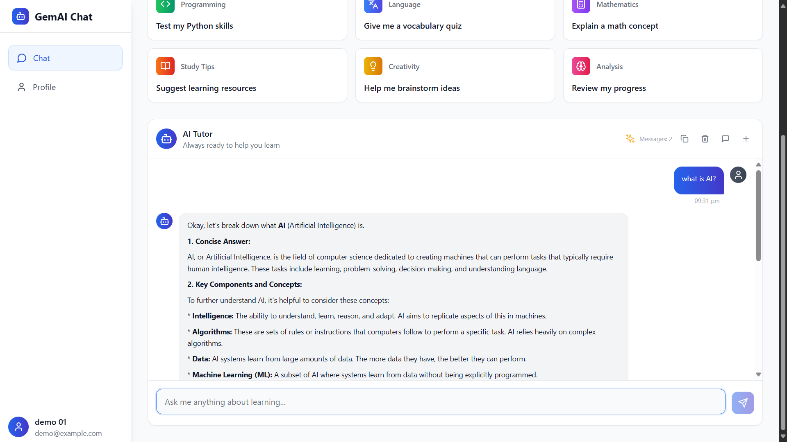

<div align="center">

# GemAI‑Chat — Conversational AI Assistant Built with Modern LLMs ✨

[](https://www.python.org/)
[](https://nodejs.org/)
[](https://www.djangoproject.com/)
[](https://react.dev/)
[](LICENSE)
[](https://github.com/)

AI‑powered, context‑aware chat with a clean UI, robust backend, and pluggable LLM providers.

</div>

---

### Overview

GemAI‑Chat is an end‑to‑end conversational AI assistant designed for fast, reliable, and context‑aware interactions. It combines a modern React + TypeScript frontend with a production‑ready Django REST API that integrates with cutting‑edge language models (e.g., Google Generative AI, OpenAI, or other providers). The system handles session history, smart model selection/fallbacks, and robust error handling so you can focus on building great AI experiences.

Why it matters:

- Turning raw LLMs into a delightful product requires UX, memory, reliability, and guardrails.
- GemAI‑Chat gives you a cohesive stack and patterns to ship AI features quickly and safely.

---

### Key Features

- **Context‑aware conversations**: Maintain session history and user context for coherent, multi‑turn dialogue.
- **Pluggable LLM providers**: Works with Google Generative AI today; can extend to OpenAI, Anthropic, etc.
- **Automatic model discovery + fallback**: Picks the best available model and gracefully degrades on failures.
- **Streaming and typing indicators**: Smooth UX with live tokens and visual feedback. (planned)
- **Prompt templates + tools**: Reusable prompts, retrieval hooks, and tool execution. (planned)
- **Chat persistence**: Store messages, sessions, and metadata with export/clear actions.
- **Role‑based replies**: System, user, assistant roles for safer prompt orchestration.
- **Observability**: Health checks, structured logs, and test utilities for AI integration.
- **Rate limiting & guardrails**: Basic protections with room to extend for policy enforcement. (planned)
- **Multi‑modal support**: Images and files as inputs for richer understanding. (planned)

---

### Demo / Screenshots


_AI response rendered in the chat thread with context retention_


_Modern, responsive chat interface with message bubbles and typing indicator_

---

### Tech Stack

- **Frontend**: React 18, TypeScript, Vite, Tailwind CSS
- **Backend**: Django 5, Django REST Framework, Python 3.10+
- **AI Providers**: Google Generative AI (current), OpenAI/LangChain (optional/extendable)
- **Database**: SQLite (dev), MySQL/PostgreSQL (prod‑ready)
- **Tooling**: npm, pip, GitHub Actions, ESLint/TypeScript

---

### Architecture

```
User Input → API (Django REST) → LLM Provider (Google GenAI/OpenAI) →
Reply Post‑Processing (formatting, guardrails) → Persistence (DB) → UI Render (React)
```

Core building blocks:

- Request validation → model selection → prompt assembly → provider call → response shaping → storage → stream/update UI.

---

### Installation

Prerequisites:

- Python 3.10+
- Node.js 18+
- A Google Generative AI or other LLM API key

Clone the repository:

```bash
git clone <your-repo-url>
cd GemAI-Chat
```

Backend (Django):

```bash
python -m venv env
./env/Scripts/activate  # Windows PowerShell
pip install -r requirements.txt  # if provided; else install Django/DRF
python backend/manage.py migrate
```

Environment (example):

```bash
# .env
GOOGLE_API_KEY=your_key_here
FALLBACK_MODEL=gemini-1.5-flash-001
SECRET_KEY=your_django_secret
DEBUG=True
```

Frontend (React):

```bash
npm install
npm run dev
```

---

### Usage

Run the backend:

```bash
python backend/manage.py runserver  # http://localhost:8000
```

Run the frontend:

```bash
npm run dev  # http://localhost:5173 (Vite default)
```

Example API call:

```bash
curl -X POST http://localhost:8000/chatbot/reply/ \
  -H "Content-Type: application/json" \
  -d '{"prompt": "Explain retrieval augmented generation in 2 sentences.", "user_id": "u1", "session_id": "s1"}'
```

---

### Project Structure (simplified)

```
backend/
  ai_chatbot/           # Django project
  chatbot/              # Chat app, views, models, routes
  manage.py
src/                    # React + TypeScript frontend
img/                    # Screenshots
```

---

### Roadmap

- [ ] Streaming responses with Server‑Sent Events/WebSockets
- [ ] Multi‑provider router (OpenAI, Anthropic, Azure OpenAI)
- [ ] Retrieval‑Augmented Generation (RAG) with vector search
- [ ] Prompt library and evaluation harness
- [ ] Content safety and policy guardrails
- [ ] Fine‑tuning hooks and adapters
- [ ] Dark mode and accessibility polish

---

### Contributing

Contributions are welcome! To get started:

1. Fork the repo and create a feature branch.
2. Make your changes with clear commits and tests where relevant.
3. Run linters/formatters; ensure the app starts locally.
4. Open a pull request with a concise description and screenshots if UI‑related.

Please follow conventional commit messages where possible and be kind in reviews 💙.

---

### License

This project is licensed under the **Apache‑2.0** License. See [`LICENSE`](LICENSE).

---

### Contact

- GitHub: `https://github.com/Buildwith18`
- Gmail: `buildwith.18@gmail.com`
- Project: `GemAI‑Chat`

If you use or like this project, consider starring it ⭐ and sharing feedback!
